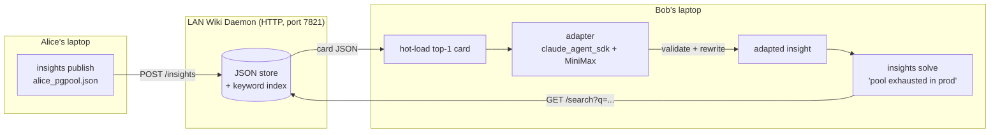

# insights-share Demo · Design

本文档是 `plan.md` 的精简、面向演示目录的落地版。目标受众为产品经理与跨团队评审人，不替代 `plan.md` 的完整背景。

## Context

`claude /insights` 能生成很好的个人 insight，但在真实团队里暴露出三个痛点：

1. **生成慢**：每位工程师都要等几十秒才能重新"悟出"队友已经悟出的那一条。
2. **insight 是私有的**：它留在某个用户的本地 profile 里，不会自动流到下一个踩坑的同事手里。
3. **生硬复用会扎手**：Alice 的 schema 上的 insight 未必匹配 Bob 的表结构，照抄可能让 Bob 的流水线更糟。

本 demo 原型化的修复：LAN 上的 **insight wiki** + **热加载 + 后台 adapter**。只拉 Bob 真正需要的那张卡片，在"用户无感知"的时间内校验并按本地上下文改写，然后把"开箱即用"的 adapted insight 交给 Bob。

## Shape of the change



"用户无感知"在实现层的含义：`solve` 一进入就立刻打印问题重述和 spinner，adapter 跑在后台协程里。PM 还在把重述读出口的时候，adapted insight 已经呈现。我们还并排打印一条假的 "slow path ~62s" 对比，让价值一眼可见。

## CLI surface

单入口 `insights_cli.py`，argparse subparsers：

```
insights serve   [--host 0.0.0.0] [--port 7821] [--store ./wiki.json]
insights publish <file.json> [--wiki http://host:7821]
insights list                  [--wiki http://host:7821]
insights solve   "<problem>"  [--wiki http://host:7821] [--no-ai]
insights demo                  # 指向 run_demo.sh
```

HTTP 客户端只用 `urllib.request`，不引入 `requests`。`solve` 的主流程：

```
restate(problem)             # 立刻打印
with timer() as t:
    hits = GET /search?q=problem&k=3
card = hits[0]
print("hot-loaded <id> from <author> (score=...)")
with spinner("validating against your context..."):
    result = asyncio.run(adapter.adapt(card, problem, local_context))
print(panel(result.adapted_insight, f"verdict={result.verdict} confidence=..."))
print(f"fast path: {t.elapsed:.1f}s (adapter: {result.latency_s:.1f}s)   slow path baseline: ~62s")
```

`--no-ai` 短路掉 adapter，直接打印原卡的 `fix` 字段——这样即使 MiniMax 不可达，demo 也能离线跑完。

## Wiki daemon (`insightsd/server.py`)

- 纯 stdlib `http.server.ThreadingHTTPServer`，零三方依赖；install footprint 只有 `claude-agent-sdk` + `python-dotenv`。
- 路由：
  - `GET  /healthz` → `{"ok": true}`
  - `GET  /insights` → 列出所有卡（id/title/author/tags）
  - `GET  /search?q=...&k=3` → 打分排序后的卡片
  - `POST /insights` → 存一张新卡（body = card JSON）
- 存储：`store.py` 单文件 `wiki.json`，bag-of-words Jaccard over title+tags+body。demo 尺寸够用，零依赖。
- 绑定 `0.0.0.0`，启动时打印探测到的 LAN IP，便于 PM 直观看到"同局域网的同事可以访问 `http://192.168.x.y:7821`"。

## Adapter (`adapter.py`)

对齐 `audit2harness/docs/agent-sdk/templates/minimal_query.py` 的风格：

- 模块加载时 `load_dotenv(Path(__file__).parent / ".env")`，只执行一次。
- `claude_agent_sdk.query(...)` 参数：
  - `permission_mode="dontAsk"`
  - `allowed_tools=[]`（纯推理，不做文件 I/O，更快更省）
  - `max_turns=2`
  - `extra_args={"bare": None}`（与模板 `minimal_query.py:55-56` 的"fast baseline"注释一致）
- Prompt 是一个紧凑的 JSON-in/JSON-out 模板：输入 card + problem + local_context，输出 `{"verdict":"adopt|adapt|reject","adapted_insight":"...","diff_summary":"...","confidence":0.0-1.0}`。
- 返回 `AdapterResult(verdict, adapted_insight, diff_summary, confidence, latency_s)` 给 `insights_cli.solve` 消费。
- **任何异常**（网络/解析/MiniMax 5xx/sdk 子进程 fail）都会被 `try/except` 捕获并转为合法 fallback：`AdapterResult(verdict="adopt", adapted_insight=card["fix"], diff_summary=f"fallback: {类型}", confidence=card.get("confidence", 0.5), latency_s=elapsed)`。demo 永远不会在 PM 面前硬崩。

## 已知缺口（demo trade-off）

以下缺口是刻意而为之，不是疏忽。真实落地前必须补齐：

| 缺口 | demo 现状 | 真实部署需要 |
|------|----------|--------------|
| 认证 | **无**。任何同局域网的人都能 publish/consume | 至少 token + mTLS；按 team / author 做 scope |
| 持久化 daemon | `run_demo.sh` 的 `trap EXIT` 会在脚本结束时 kill daemon | launchd / systemd unit，带日志轮转 + 健康自恢复 |
| 存储 | 单个 `wiki.json` 文件 + 进程内锁 | SQLite/Postgres + 版本管理 + 冲突处理 |
| 检索 | bag-of-words Jaccard over 3 张卡 | 向量库（faiss / pgvector）+ 混合检索，配合离线 embed 流水线 |
| adapter 观测 | 只打印 latency，错误写 stderr | 结构化 trace + 成功率/fallback 率看板 |
| 数据隐私 | 卡片明文落盘 | 字段级脱敏策略，PII 扫描后才进 wiki |

这些缺口都在 `plan.md` 的 "What this plan deliberately does NOT include" 节列明，本 demo 目录的 `design.md` 在此复述，目的是让评审人在 5 分钟内知道"demo 能证明什么、不能证明什么"。
