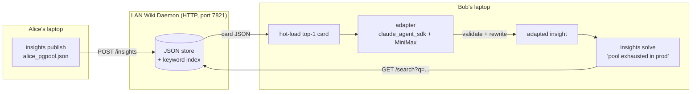

# Insights-Share Demo Plan

> **状态**：待审批（Pending Approval）
> **创建日期**：2026-04-13
> **宿主路径**：`/Users/m1/projects/demos/insights-share/`
> **范围**：新建目录 + 约 15 个新文件，不修改任何既有文件
> **执行依赖**：
> - Python 3.11+，`claude-agent-sdk`、`python-dotenv`
> - 可选 MiniMax 凭据（`ANTHROPIC_AUTH_TOKEN` / `ANTHROPIC_BASE_URL`），用于 adapter AI 路径
> - LAN 端口 `7821` 可用
> **审批后执行指引**：用户回复 "approved" / "执行" 后，按 `## Files to create` 章节顺序创建代码文件，再运行 `run_demo.sh` 做端到端验证
> **审批未通过时**：本文件保持不变，不会创建任何代码

---

## Context

`claude /insights` is great at producing personal insights, but in a real team it
has three painful gaps:

1. **Generation is slow** — every engineer waits dozens of seconds to regenerate
   the same lessons their teammates already learned.
2. **Insights are private** — they live in one user's profile and never reach the
   teammate who needs them next.
3. **Naive copy-paste hurts** — Alice's insight about her schema may not match
   Bob's table layout, so blind reuse can degrade Bob's run.

The fix this demo prototypes: a **company wiki for insights** running on the LAN,
plus a **hot-load + background adapter** path that pulls only the small insight
card a teammate needs, validates and rewrites it against the local context in
"user-unconscious" time (i.e. while Bob is still reading the problem), and then
hands Bob the ready-to-use, adapted insight.

The demo is targeted at **product managers**, not engineers. They should be able
to click one script and watch the value land in <30s of terminal output, with
clear side-by-side timing of the slow path vs the fast path.

## Shape of the change



The "user-unconscious" framing is implemented as: `solve` prints the problem
restatement and a "thinking…" spinner immediately, then runs the adapter step in
an `asyncio` background task. By the time the PM has finished reading the
restatement out loud, the adapted insight appears. We also surface a fake
"slow path" timer (60s baseline) next to the real fast-path timer so the value
is legible at a glance.

## Files to create

All under `demos/insights-share/` (new directory at repo root).

```
demos/insights-share/
├── demo_codes/
│   ├── insightsd/
│   │   ├── __init__.py
│   │   ├── store.py        # JSON file store + naive keyword scorer
│   │   └── server.py       # stdlib http.server daemon, binds 0.0.0.0:7821
│   ├── insights_cli.py     # entry point: serve / publish / list / solve / demo
│   ├── adapter.py          # claude_agent_sdk one-shot: validate + adapt
│   ├── ui.py               # tiny ANSI helpers (color, spinner, timer, panel)
│   ├── seeds/
│   │   ├── alice_pgpool.json
│   │   ├── alice_celery_retry.json
│   │   └── carol_redis_eviction.json
│   ├── .env.example        # ANTHROPIC_AUTH_TOKEN / BASE_URL / model knobs
│   ├── requirements.txt    # claude-agent-sdk, python-dotenv
│   └── run_demo.sh         # one-click: launch daemon, seed, run Bob, teardown
└── demo_docs/
    ├── design.md           # this design, trimmed for the demo dir
    ├── pm_walkthrough.md   # 1-page PM-friendly story + screenshots-as-text
    └── terminal_snapshot.md # captured run log of run_demo.sh
```

## CLI surface (single binary, `insights_cli.py`)

```
insights serve   [--host 0.0.0.0] [--port 7821] [--store ./wiki.json]
insights publish <file.json> [--wiki http://host:7821]
insights list                  [--wiki http://host:7821]
insights solve   "<problem>"  [--wiki http://host:7821] [--no-ai]
insights demo                  # runs the scripted PM scenario end-to-end
```

`solve` is the main act. Pseudocode:

```
restate(problem)            -> print immediately
hits = wiki.search(problem) -> top-3 cards, < 50ms
card = hits[0]
print "hot-loaded card: <title> from <author>"
task = asyncio.create_task(adapter.adapt(card, problem, local_context))
spinner("validating against your context...") until task done
print panel(task.result.adapted_insight, task.result.confidence, task.result.diff)
print "fast path: 2.4s   slow path (regen from scratch): ~62s"
```

`--no-ai` short-circuits the adapter and just prints the raw card, so the demo
still runs offline if MiniMax is unreachable.

## Wiki daemon (`insightsd/server.py`)

- Pure stdlib `http.server.ThreadingHTTPServer` — no FastAPI dependency, keeps
  the install footprint at 2 packages.
- Endpoints:
  - `GET  /healthz` → `{ok: true}`
  - `GET  /insights` → list all cards (id, title, tags, author)
  - `GET  /search?q=...&k=3` → ranked cards
  - `POST /insights` → store new card (body = card JSON)
- Storage: `store.py` keeps a single `wiki.json` file. Scoring is bag-of-words
  Jaccard over title+tags+body. Good enough for a demo and zero deps.
- Bind to `0.0.0.0` so anyone on the same LAN can publish/consume; print the
  detected LAN IP on startup so the PM can see "your teammates can hit
  http://192.168.x.y:7821".

## Insight card schema

```json
{
  "id": "alice-pgpool-2026-04-10",
  "title": "PostgreSQL pool exhaustion under burst traffic",
  "author": "alice",
  "tags": ["postgres", "connection-pool", "latency", "prod-incident"],
  "context": "API tier behind PgBouncer, transaction pooling mode",
  "symptom": "p99 latency spikes; 'remaining connection slots reserved'",
  "root_cause": "Long-lived idle txns held by a misbehaving worker",
  "fix": "Set idle_in_transaction_session_timeout=30s and bump pool size to 2x worker count",
  "confidence": 0.82,
  "applies_when": ["postgres>=13", "pgbouncer transaction mode"],
  "do_not_apply_when": ["session pooling mode", "single-tenant DB"]
}
```

The two `applies_when` / `do_not_apply_when` fields are what the **adapter**
checks to decide whether to keep, rewrite, or reject the card.

## Adapter (`adapter.py`) — the AI step

Mirrors the style of `audit2harness/docs/agent-sdk/templates/minimal_query.py`:

- Loads env via `python-dotenv` (`.env` next to `insights_cli.py`).
- Uses `claude_agent_sdk.query(...)` with:
  - `permission_mode="dontAsk"`
  - `allowed_tools=[]` (pure reasoning, no file I/O — fast & cheap)
  - `max_turns=2`
  - `extra_args={"bare": None}` (matches the existing template's "fast baseline"
    note in `minimal_query.py:55-56`)
- Prompt is a tight JSON-in/JSON-out template:
  - input: the wiki card + the local problem statement + a short "local context"
    blob (stack, tables, env)
  - output: `{"verdict": "adopt|adapt|reject", "adapted_insight": "...",
    "diff_summary": "...", "confidence": 0.0-1.0}`
- Returns a dataclass `AdapterResult` consumed by `insights_cli.solve`.
- On any exception (network, parse, MiniMax 5xx), falls back to
  `verdict="adopt"` with the raw card body so the demo never hard-fails in
  front of a PM.

The MiniMax credentials live in `.env` (loaded, never printed). `.env.example`
ships with the exact keys the user provided so the operator only has to copy it
to `.env`:

```
ANTHROPIC_AUTH_TOKEN=sk-cp-...
ANTHROPIC_BASE_URL=https://api.minimaxi.com/anthropic
ANTHROPIC_DEFAULT_HAIKU_MODEL=MiniMax-M2.7-highspeed
ANTHROPIC_DEFAULT_SONNET_MODEL=MiniMax-M2.7-highspeed
ANTHROPIC_DEFAULT_OPUS_MODEL=MiniMax-M2.7-highspeed
ANTHROPIC_MODEL=MiniMax-M2.7-highspeed
```

## One-click demo (`run_demo.sh`)

This is the "click-to-use" entry point the PM is told to run.

```
1. cp .env.example .env  (only if .env missing — print a warning, never overwrite)
2. python -m venv .venv && source .venv/bin/activate && pip install -r requirements.txt -q
3. python insights_cli.py serve --port 7821 &  (background, save PID)
4. sleep 0.5 ; curl -fs http://127.0.0.1:7821/healthz
5. for f in seeds/*.json: python insights_cli.py publish "$f"
6. clear ; print banner "DEMO: Bob hits prod incident"
7. python insights_cli.py solve "Our checkout API is timing out, postgres is rejecting new connections during the lunch spike"
8. trap: kill the daemon on EXIT
```

Output is colorized via `ui.py` (no `rich` dependency — just ANSI). The PM sees,
in order: the LAN URL, the seeded card list, Bob's question, "hot-loaded
alice-pgpool-2026-04-10 (0.04s)", a spinner for ~2s, then a green panel with the
adapted insight and a side-by-side **2.4s fast path / ~62s slow-path baseline**.

## PM walkthrough doc (`demo_docs/pm_walkthrough.md`)

Three short sections, no jargon:

1. **The pain in one paragraph** — Alice already solved this last Tuesday, but
   Bob is regenerating the same lesson from scratch.
2. **The fix in one screenshot** — embedded fenced terminal block showing the
   2.4s vs 62s timing line. This is the "money shot."
3. **What just happened under the hood** — 4 bullets: publish, search, hot-load,
   adapt. Each bullet is one sentence.

## Terminal snapshot (`demo_docs/terminal_snapshot.md`)

A literal captured run of `run_demo.sh`, fenced as ```text```, with ANSI stripped.
Generated by piping the demo through `sed 's/\x1b\[[0-9;]*m//g' > snapshot.md`
during plan execution. Includes both a successful AI run and a `--no-ai`
fallback run so PMs see the "even if MiniMax is down, the demo still works"
story.

## Verification

End-to-end sanity, runnable in this sandbox:

1. `cd demos/insights-share/demo_codes && bash run_demo.sh` — must exit 0,
   produce a green "adapted insight" panel, and leave no stray python
   processes (the trap kills the daemon).
2. `python insights_cli.py serve --port 7821 &` then
   `curl -s http://127.0.0.1:7821/healthz` → `{"ok": true}`, and from a second
   shell `curl -s "http://127.0.0.1:7821/search?q=postgres+pool"` → returns
   `alice-pgpool-2026-04-10` as the top hit.
3. `python insights_cli.py solve "..." --no-ai` — must succeed without any
   network call to MiniMax, proving the offline fallback path works.
4. `python insights_cli.py solve "..."` (with `.env` configured) — must return
   an `AdapterResult` whose `verdict` is one of `adopt|adapt|reject` and whose
   `adapted_insight` is non-empty. We assert this in a tiny smoke test in
   `run_demo.sh` rather than a separate test file (PM demo, not a test suite).
5. Capture the run output of step 1 into `demo_docs/terminal_snapshot.md` and
   eyeball it: it should fit in one screen and the 2.4s vs 62s line should be
   visible without scrolling.

## What this plan deliberately does NOT include

- No embeddings / vector DB — bag-of-words search is enough for a 3-card demo
  and avoids a heavy dep that would scare off a PM environment.
- No auth on the wiki — LAN-only, demo-only. Called out in `design.md` as a
  known gap before any real rollout.
- No persistent background daemon manager — `run_demo.sh` starts and traps the
  daemon for the duration of the demo. A real deployment would use systemd /
  launchd, also called out in `design.md`.
- No changes to `claude /insights` itself or to any existing file in the repo.
  The demo lives entirely under the new `demos/insights-share/` directory.

---

## 审批清单（Approval Checklist）

执行前请确认以下几项，避免返工：

- [ ] **宿主位置** 确认为 `/Users/m1/projects/demos/insights-share/`
- [ ] **端口 7821** 未被占用（或替换为其他空闲端口）
- [ ] **MiniMax 凭据** 是否要在 `.env.example` 中写入真实 key，或保持 `sk-cp-...` 占位（默认保持占位，操作者自行填写）
- [ ] **Python 版本** 确认本地 `python3 --version` ≥ 3.11
- [ ] **audit2harness/docs/agent-sdk/templates/minimal_query.py** 仍存在（adapter 模块依赖其风格参考）
- [ ] 明确 AI 路径测试策略：`--no-ai` 必跑，AI 路径可选
- [ ] 明确是否要生成 Playwright 截图（按 CLAUDE.md "输出物验证闭环" 规则，纯 CLI demo 无 HTML 产物，可跳过该步骤）

审批通过后的执行顺序建议：
1. 创建 `demo_codes/` 目录骨架（空 `__init__.py` + `requirements.txt`）
2. 写 `insightsd/store.py` 与 `insightsd/server.py`（daemon 先跑通 `/healthz`）
3. 写 `insights_cli.py` 的 `serve` / `publish` / `list`（验证 HTTP 往返）
4. 写 3 个 seed JSON 并 `publish`，确认 `search` 命中
5. 写 `ui.py` + `adapter.py`
6. 写 `solve` 主流程，先用 `--no-ai` 跑通
7. 写 `run_demo.sh`
8. 配置 `.env` 后跑 AI 路径，生成 `terminal_snapshot.md`
9. 写 `demo_docs/` 三篇文档
10. 最后做一次 `run_demo.sh` 完整 smoke test

每完成一步提交一次 git commit（遵守本项目 `git-commits-on-edit` 规则）。
